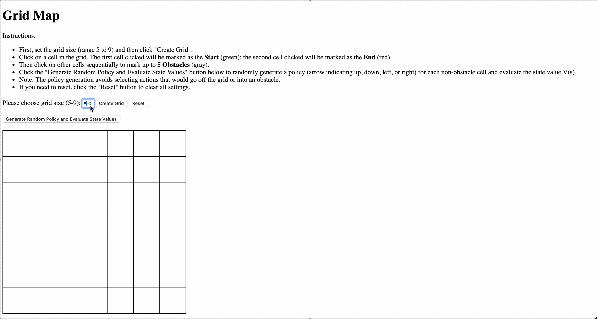

# Project 

The project is a web-based grid map application developed with Flask, HTML, CSS, and JavaScript. It lets users create a grid with a variable size between 5 and 9, choose a start and end cell, and mark obstacles. Moreover, it integrates reinforcement learning by creating a random policy and computing state values via an iterative policy evaluation method.

## Demo


Below are the evaluation criteria along with their respective weightings:

## 1. 網格地圖功能完整性 Grid Map Functionality Completeness (30%)
- **動態網格生成：** 支援從 5x5 到 9x9 的網格尺寸。  
- **互動式格子選擇：** 使用者可以指定起點、終點及障礙物。  
- **視覺反饋：** 每個格子根據使用者操作正確更新其顯示。

## 2. 使用者界面友好性 User Interface Friendliness (15%)
- **清晰指示：** 介面提供逐步操作指南，方便使用應用程式。  
- **直覺式控制：** 生成網格、重置及產生策略的按鈕設置易於使用。  
- **視覺指示：** 即時的視覺反饋（顏色變化與符號）提升使用者體驗。

## 3. 程式碼結構與可讀性 Code Structure and Readability (10%)
- **模組化組織：** 將 Flask 後端與前端代碼 HTML 分離。  
- **程式碼註解：** 附有完整註解，便於理解與維護。  
- **最佳實踐：** 遵循程式碼標準及慣例，以確保代碼清晰。

## 4. 網頁操作流暢度 Web Page Operation Smoothness (5%)
- **互動迅速：** 點擊格子、重置網格或生成策略時，過渡流暢。  
- **更新最佳化：** 高效處理 DOM 更新，避免明顯延遲。  
- **錯誤處理：** 對非預期使用者操作進行優雅處理。

## 5. 隨機生成行動顯示功能 Random Action Display Functionality (20%)
- **有效行動生成：** 僅在動作有效（不超出網格或進入障礙物）的情況下隨機分配箭頭。  
- **視覺呈現：** 每個非障礙物格子均清楚顯示選取的箭頭。  
- **無縫整合：** 隨機行動生成功能與網格互動特性完美整合。

## 6. 策略評估的正確性 Policy Evaluation Accuracy (15%)
- **迭代評估：** 使用折扣因子 (γ = 0.9) 的迭代算法計算狀態價值。  
- **正確處理：** 妥善管理終點狀態（終點格子值固定為 0）及障礙物。  
- **價值反映：** 計算出的狀態價值精確反映預期的強化學習模型。

## 7. 程式碼結構與可讀性 Additional Code Structure and Readability (5%)
- **工具函數：** 輔助工具函數以模組化方式組織。  
- **易於維護：** 程式碼結構便於未來更新與擴展。  
- **實作清晰：** 特別強調編寫清晰且簡潔的程式碼，以便未來增強功能。

---

# How to Use This Project

## Installation
1. **Clone the Repository:**
   ```bash
   git clone https://github.com/YANGCHIHUNG/DRL.git
   cd hw1
   ```
2. **(Optional) Create a Virtual Environment:**
   ```bash
   python -m venv venv
   source venv/bin/activate  # On Windows use: venv\Scripts\activate
   ```
3. **Install Dependencies:**
   ```bash
   pip install -r requirements.txt
   ```
4. **Run the Application:**
   ```bash
   python app.py
   ```
5. **Access the Application:**
   Open your browser and go to [http://127.0.0.1:5000](http://127.0.0.1:5000).

## 🧭 Prompt Guide: How to Generate an Interactive Grid RL Demo

### 🎯 Goal

Create a web-based grid map interface using **HTML, CSS, and JavaScript** where users can:

- Choose the grid size (**5–9**)
- Select a **start point**, **end point**, and **obstacles**
- Generate a **random policy**
- Use **policy evaluation** with defined rewards:
  - `-1` per step  
  - `+10` for reaching the goal  
  - **Impassable** obstacles and boundaries
- Display the value function **V(s)** and **policy arrows**


Enjoy exploring the grid map and experimenting with basic reinforcement learning functionalities!
