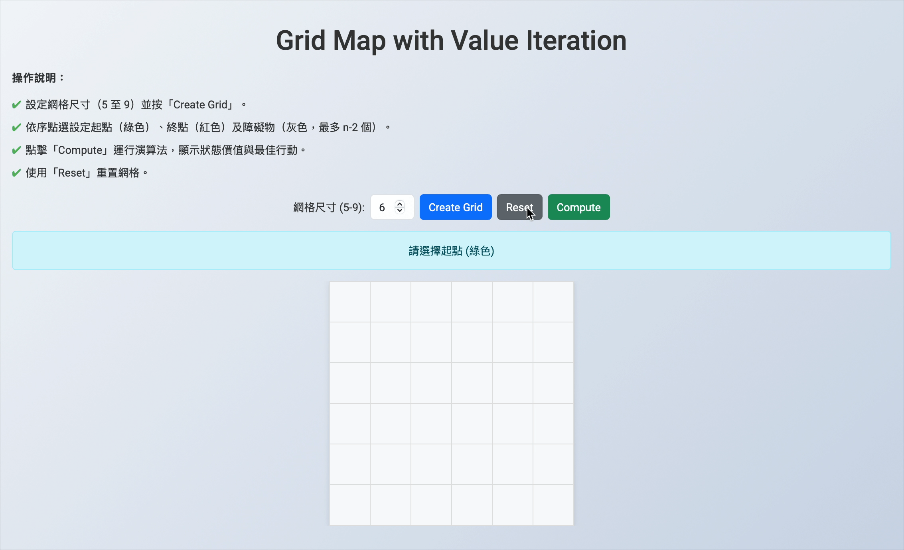

# Grid Map with Value Iteration

A Flask-based web application that allows users to interactively create an nxn grid map, designate a start cell, an end cell, and obstacles, and then compute the optimal policy using the Value Iteration algorithm.

## Demo


## Features

- **Interactive Grid Creation:**
  - Choose a grid size between 5 and 9.
  - Click to set a start cell (green), an end cell (red), and up to n-2 obstacles (gray).
- **Value Iteration Algorithm:**
  - Computes optimal state values and policies for each cell.
  - Displays the optimal action (arrow) and state value within each cell.
- **Optimal Path Animation:**
  - Animates the optimal path from the start to the end cell (excluding the start and end cells).
- **Refined User Interface:**
  - Enhanced design with modern CSS, a responsive layout, smooth transitions, and Google Fonts (Roboto).

## Value Iteration Explanation

Value Iteration is a dynamic programming algorithm used to solve Markov Decision Processes (MDPs). It iteratively updates the value of each state by applying the Bellman optimality equation:

V(s) = max_a [ R(s, a) + γ * V(s') ]

where:
- `V(s)` is the value of state `s`,
- `R(s, a)` is the immediate reward (in this project, a cost of -1 per move),
- `γ` (gamma) is the discount factor (set to 0.9),
- `V(s')` is the value of the subsequent state after taking action `a`.

The algorithm repeatedly updates the state values until they converge or a set number of iterations is reached. The optimal policy is derived by choosing the action that maximizes the value function at each state. This process efficiently computes both the state values and the best actions even in the presence of obstacles and terminal states.

## Getting Started

### Installation

1. **Clone the Repository:**
   ```bash
   git clone <repository-url>
   cd <repository-directory>
   ```
2. **Create and Activate a Virtual Environment:**
   ```bash
   python3 -m venv venv
   source venv/bin/activate  # For Windows: venv\Scripts\activate
   ```
3. **Install Dependencies:**
   ```bash
   pip install -r requirements.txt
   ```
4. **Run the Application:**
   ```bash
   python app.py
   ```
5. **Access the Application:**
   Open your browser and go to [http://127.0.0.1:5000](http://127.0.0.1:5000).

## Usage

1. **Set the Grid Size:**  
   Enter a grid size between 5 and 9 and click "Create Grid".
2. **Configure the Grid:**  
   - Click on a cell to set the start (green).
   - Click on another cell to set the end (red).
   - Click additional cells to mark obstacles (gray) until reaching the maximum allowed (n-2).
3. **Compute the Optimal Policy:**  
   Click the "Compute Optimal Policy and Value" button to run the value iteration algorithm. The optimal action (displayed as an arrow) and state value will appear in each cell.
4. **View the Optimal Path:**  
   The optimal path from the start to the end cell will be animated, highlighting the intermediate cells in light green.
5. **Reset the Grid:**  
   Click the "Reset" button to clear the grid and start over.

## Customization

- **User Interface:**
  - The UI can be further refined by modifying the CSS styles in `index.html`.
  - The current design utilizes a responsive container, Google Fonts (Roboto), and smooth transition effects.
- **Algorithm Parameters:**
  - Adjust the discount factor (`gamma`) and iteration count in the JavaScript section of `index.html` to fine-tune the behavior of the value iteration algorithm.