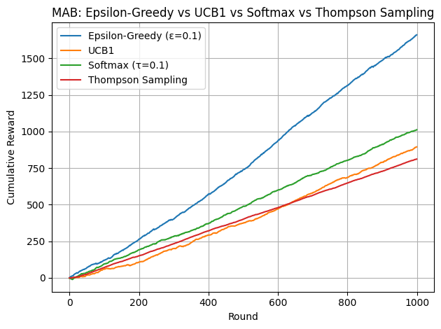

# HW3：多臂賭博機（MAB）探索與利用

## 一、專案介紹  
本專案為國立中興大學 2025 春季《強化學習》課程第三次作業，實作並比較四種常見的多臂賭博機演算法：  
- ε‐Greedy  
- UCB1 (Upper Confidence Bound)  
- Softmax (Boltzmann)  
- Thompson Sampling  

透過模擬 `N_ARMS=10` 臂、`N_ROUNDS=1000` 輪的拉桿實驗，比較各演算法的累積報酬（Cumulative Reward）曲線，並以 matplotlib 繪圖。

## 二、目錄結構  
```
hw3/
├── algo.tex            # 演算法理論說明（LaTeX）
├── main.ipynb          # Jupyter Notebook 實作與可視化
├── 結果解釋.md         # 模擬結果分析
├── README.md           # 專案說明（本檔案）
└── requirements.txt?   # （可選）相依套件列表
```

## 三、環境與安裝  
1. Python 3.7+  
2. 安裝套件  
   ```bash
   pip install numpy matplotlib jupyter
   ```  
3. 啟動 Notebook  
   ```bash
   cd /Users/young/Documents/nchu-2025-spring/DRL/hw3
   jupyter notebook main.ipynb
   ```

## 四、程式說明  

1. `main.ipynb`  
   - 定義四個 Bandit 類別：  
     - `EpsilonGreedy(n_arms, epsilon)`  
     - `UCB1(n_arms)`  
     - `SoftmaxBandit(n_arms, temperature)`  
     - `ThompsonSampling(n_arms)`  
   - `simulate(agent, n_arms, n_rounds, binary=False)`：  
     模擬拉桿過程並回傳每輪的累積報酬序列。  
   - 主程式設定：  
     ```python
     N_ARMS = 10
     N_ROUNDS = 1000
     eg = EpsilonGreedy(N_ARMS, epsilon=0.1)
     ucb = UCB1(N_ARMS)
     sm = SoftmaxBandit(N_ARMS, temperature=0.1)
     ts = ThompsonSampling(N_ARMS)
     ```
   - 最後以 `matplotlib` 繪製累積報酬比較圖。

2. `algo.tex`  
   - 詳細數學推導與演算法步驟說明（包含 ε‐Greedy、UCB、Softmax、Thompson Sampling）。

3. `結果解釋.md`  
   - 對各演算法最終累積報酬與曲線形態的分析與比較。

## 五、如何執行  
1. 確認安裝相依套件。  
2. 在終端機切換到專案根目錄：  
   ```bash
   cd /Users/young/Documents/nchu-2025-spring/DRL/hw3
   ```  
3. 啟動 Jupyter Notebook：  
   ```bash
   jupyter notebook main.ipynb
   ```  
4. 執行所有 Cell，即可在最後看到四條不同演算法的累積報酬曲線。

## 六、結果

以下為各演算法在 1,000 輪模擬中的累積回報曲線比較：  


- ε‐Greedy (ε=0.1)：適度探索，快速收斂  
- UCB1：初期探索強，後期利用集中  
- Softmax (τ=0.1)：類似強貪婪、保留隨機性  
- Thompson Sampling：貝式抽樣策略，整體表現穩定  

詳見 [結果解釋.md](./結果解釋.md)。

## 作者  
CHI HUNG YANG  
May 2025  