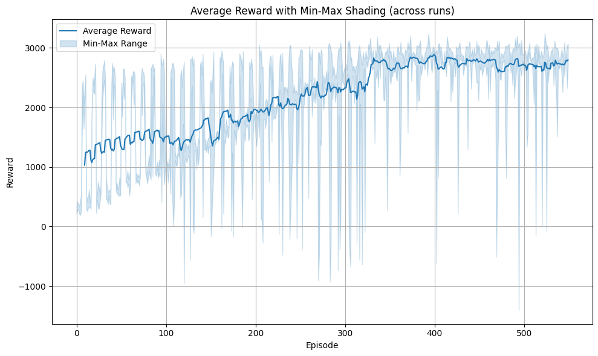

# 基於 SAC 深度強化式學習於 5G 網路高度動態流量條件下之資源允入控制最佳化

| 報酬曲線 (Reward) | 損失曲線 (Loss) |
|:-----------------:|:---------------:|
|  |  |

## 執行方式

### 1. 建立虛擬環境並安裝套件

```bash
# 從 GitHub 取得此專案
git clone https://github.com/YANGCHIHUNG/DRL.git
# 進入第 5 題程式碼目錄
cd DRL/hw5
```

```bash
python3 -m venv .venv
source .venv/bin/activate
pip install -r requirements.txt
```

### 2. 執行訓練
```bash
python scripts/train.py --config config.yaml
```

### 3. 繪製與檢視結果
```bash
jupyter notebook scripts/plot_metrics.ipynb
```